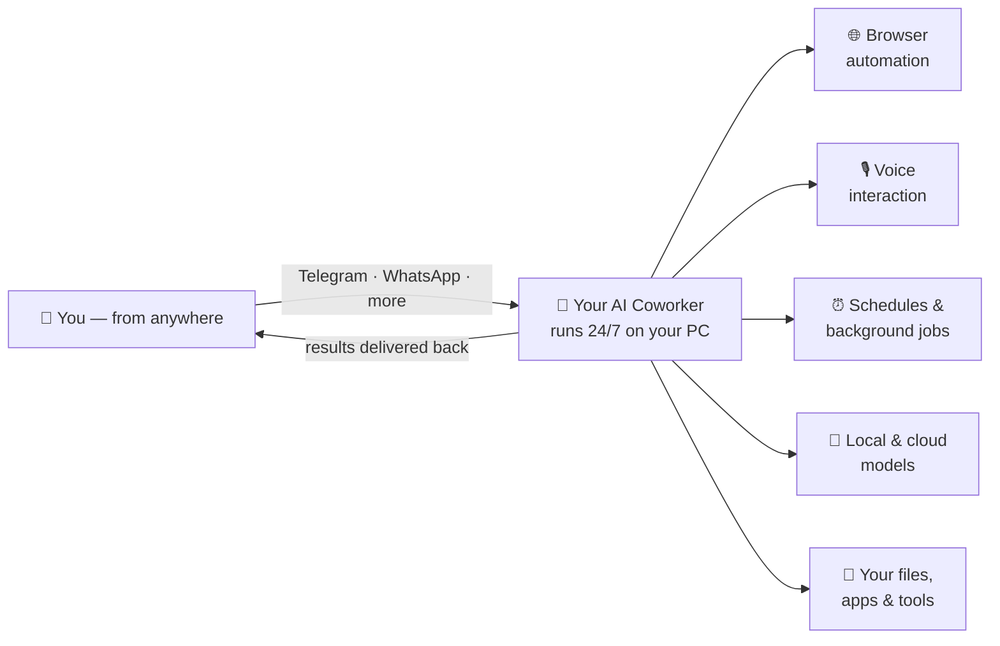
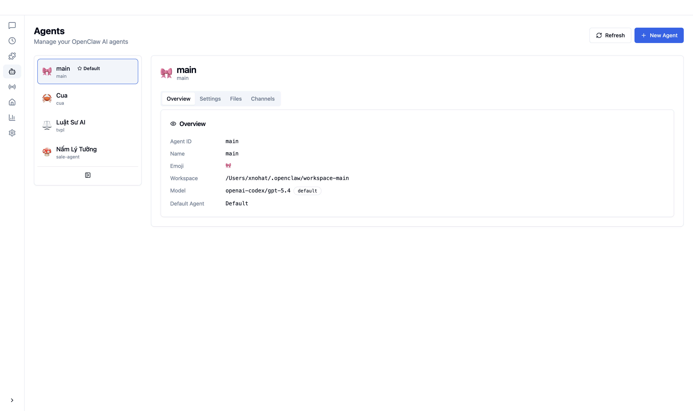
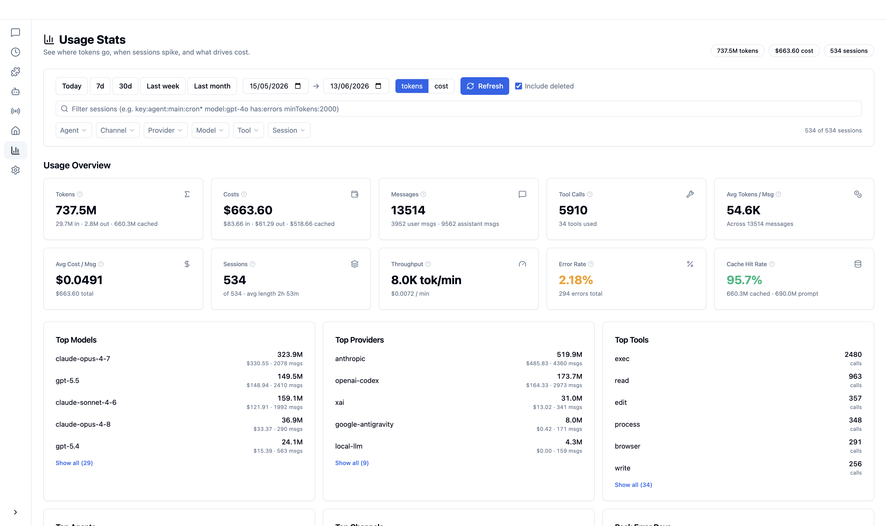
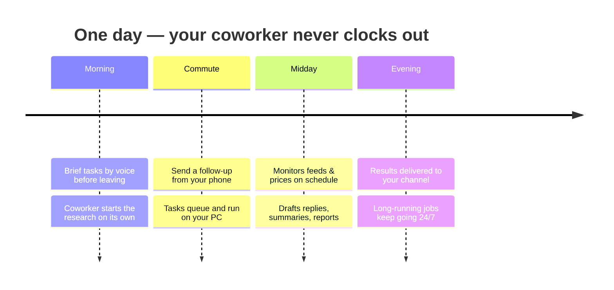
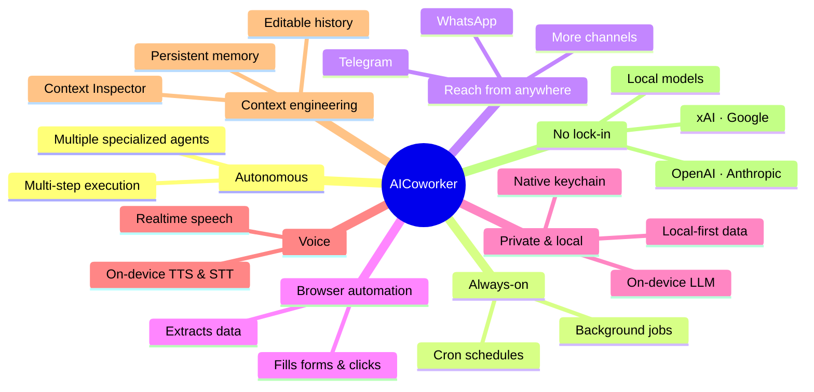

  

<h1 align="center">AICoworker</h1>

  <strong>Agentic AI Assistant for knowledge work</strong>

  A real AI Coworker that runs 24/7 on your personal computer, securely accessible from anywhere, 
  and capable of completing tasks fully autonomously.

  <a href="#what-is-aicoworker">What is AICoworker</a> •
  <a href="#what-makes-it-different">What Makes It Different</a> •
  <a href="#capabilities">Capabilities</a> •
  <a href="#download">Download</a> •
  <a href="#license">License</a>

  
  
  
  

  English | <a href="README.vi.md">Tiếng Việt</a>

---

## What is AICoworker

**AICoworker is a real AI coworker, not just another chatbot.** It lives on your own computer, works around the clock, and is reachable from anywhere — so you can hand off real knowledge work and get it done while you're away from your desk.

Most AI tools wait for you to type a prompt and watch the result. AICoworker is built for **delegation**: give it a goal, and it plans, uses tools, runs multi-step workflows, and reports back — on its own. Because it runs on *your* machine, it has the context, files, accounts, and tools a real coworker would have, with your data staying under your control.

- **Runs 24/7 on your personal computer** — an always-on agent that keeps working in the background, on a schedule, or in response to events, even when you're not watching.
- **Securely accessible from anywhere** — reach your coworker through your everyday messaging apps. Send a task from your phone on the commute; it executes back at your desk.
- **Completes tasks fully autonomously** — multi-step plans, tool use, file operations, web automation, and scheduled jobs that run to completion without hand-holding.

---

## Screenshot

  

  

  

  

  

  

  

  

---

## What Makes It Different

Cloud chat assistants are rented brains in someone else's data center. AICoworker is a coworker that **lives on your machine and works for you** — which changes what it can do.

| Typical AI chatbot | AICoworker |
|--------------------|------------|
| Waits for each prompt, you watch it work | Delegate a goal — it plans and executes autonomously, end to end |
| Online only, one tab at a time | Runs 24/7 in the background, on schedules, across many channels |
| Your data lives in the cloud | Local-first — runs on your machine, your data stays with you |
| Locked to one provider's models | Mix cloud + on-device models freely; switch per task |
| Text in, text out | Browser automation, file ops, voice, images, and tools |
| Reach it only from its website | Reach it from Telegram, WhatsApp, and more — from anywhere |
| Forgets between sessions | Persistent memory and transparent, editable context |

### A day with your AI Coworker

---

## Capabilities

### 🤖 Fully Autonomous Task Completion
Delegate a goal, not just a prompt. AICoworker decomposes work into steps, calls tools, automates the browser, reads and writes files, runs commands, and drives the whole task to completion — then reports back. Spin up **multiple specialized agents** (e.g. a researcher, a sales assistant, a legal helper), each with its own workspace, model, and personality.

### 🌐 Agentic Browser Automation
A built-in browser the agent can actually *use* — navigate sites, fill forms, click through flows, extract data, and complete web tasks the way a person would, with advanced anti-detection so real sites just work. It also unlocks web logins for AI services so the agent can act on your behalf, securely, from your own machine.

### 🧠 Local LLM — Private, On-Device AI
Run capable models **entirely on your own hardware** — no API keys, no cloud, no data leaving your computer. On-device models support **native multimodal** input (image *and* audio), GPU-accelerated, so you get a fully private assistant even offline. Mix and match: use a frontier cloud model for hard reasoning and a local model for private or high-volume work.

### 🎙️ Realtime Voice Interaction
Talk to your coworker and hear it talk back. Push-to-talk and live, low-latency speech-to-speech let you brief tasks hands-free, with both cloud realtime voice and **on-device voice (TTS + STT)** for private, offline conversations.

### ⏰ Schedules & Always-On Automation
Your coworker doesn't clock out. Schedule recurring jobs with cron-style triggers, launch long-running background tasks, and let agents work around the clock — monitoring, summarizing, and acting while you sleep. Results land in your chosen channel.

### 📡 Multi-Channel — Reach It From Anywhere
Connect everyday messaging channels (Telegram, WhatsApp, and more) so you can assign tasks and receive results wherever you are. Fire off a request from your phone on the go; it runs on your computer and replies back through the same channel.

### 🔐 Enterprise-Grade Security & Privacy
**Local-first by design.** Work runs on your own machine and your data stays with you — not on a vendor's servers. Credentials and API keys are stored in your operating system's **native secure keychain**, never in plaintext. Combined with on-device models, AICoworker is suited for sensitive and regulated knowledge work where data residency matters.

### 🧩 Advanced Context Engineering
See and control exactly what the AI is thinking about. A built-in **Context Inspector** decomposes every outgoing request so you can audit, include, or exclude content token-by-token. **Persistent session memory** keeps your coworker continuous across days, and you can **edit, add, or remove** any part of the conversation history — giving you precise control over cost, focus, and accuracy.

### 🔌 Bring Your Own Models — No Lock-In
Connect multiple AI providers (OpenAI, Anthropic, xAI/Grok, Google, on-device models, and more) and choose the right model for each task. Switch providers freely; you're never locked to a single vendor.

### 🛠️ Extensible Skills
Extend your coworker with installable skills for new abilities and integrations. Browse, install, and manage them from a visual panel — no package managers, no terminal.

### 📊 Usage & Cost Insights
A built-in stats dashboard shows where tokens go, which models and tools drive cost, and how usage trends over time — so an always-on autonomous coworker never becomes a black box.

### 🎯 Zero-Config, Multi-Language Desktop App
Install and go. A guided setup wizard takes you from install to your first autonomous task with no terminal, no config files, and no setup friction — with light/dark themes and a multi-language interface (English, Tiếng Việt, 中文, 日本語).

---

## Download

Get the latest release for your platform — no setup, no command line:

### 👉 [Download AICoworker (latest release)](https://github.com/Neurons-ai/AICoworker/releases/latest)

Available for **macOS**, **Windows**, and **Linux**.

### System Requirements

- **Operating System**: macOS 11+, Windows 10+, or Linux (Ubuntu 20.04+)
- **Memory**: 4GB RAM minimum (8GB recommended; more for on-device models)
- **Storage**: 1GB available disk space (plus space for any local models you download)

### First Launch

When you open AICoworker for the first time, a **Setup Wizard** guides you through:

1. **Language & Region** – Choose your preferred locale
2. **AI Provider** – Connect your accounts or enter API keys (or pick an on-device model)
3. **Skill Bundles** – Select pre-configured skills for common use cases
4. **Verification** – Confirm everything works before you start delegating

---

## Community

Join our community to connect with other users, get support, and share what your coworker is getting done.

---

## License

AICoworker is **source-available** software — the source is published so you can read and audit it, but it is **not open-source**. It is released under the [PolyForm Perimeter License 1.0.0](LICENSE).
Copyright © 2026 Neurons AI. All rights reserved.

**You're free to:**
- Use AICoworker for free — personally or commercially within any company
- Read and audit the source code for your own or your company's internal use

**You're not allowed to:**
- Resell, host, or distribute AICoworker as a competing product (e.g., SaaS hosting, white-label rebrand, hosted-API extraction of internal modules)
- Remove copyright or license notices

For a friendly, side-by-side English / Tiếng Việt summary, see [LICENSE_PLAIN_ENGLISH.md](LICENSE_PLAIN_ENGLISH.md).

For commercial licensing (SaaS hosting, OEM bundle, white-label), contact **contact@neuronsai.net**.

---

  Built with ❤️ by the Neurons AI Team

