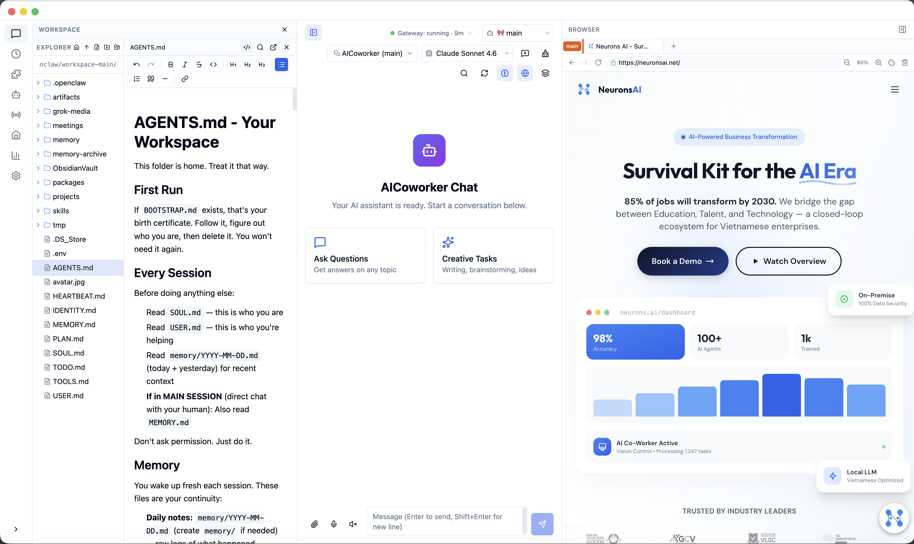
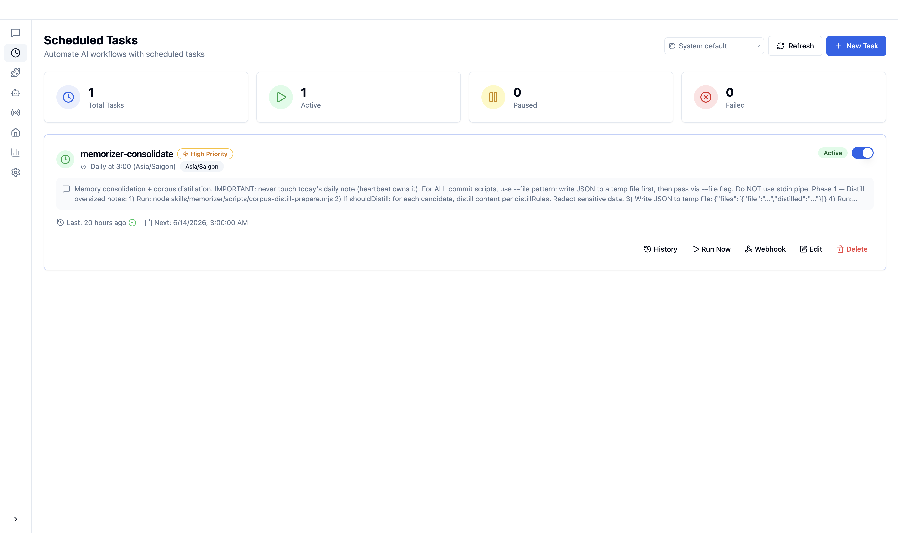
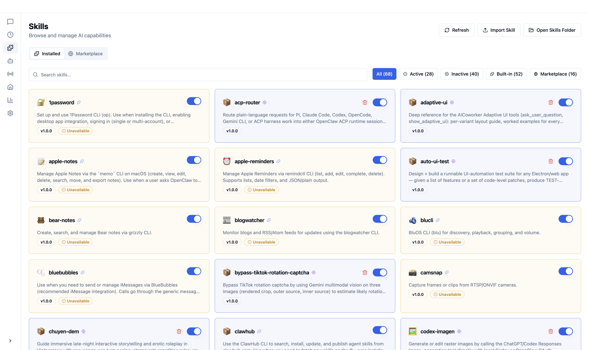
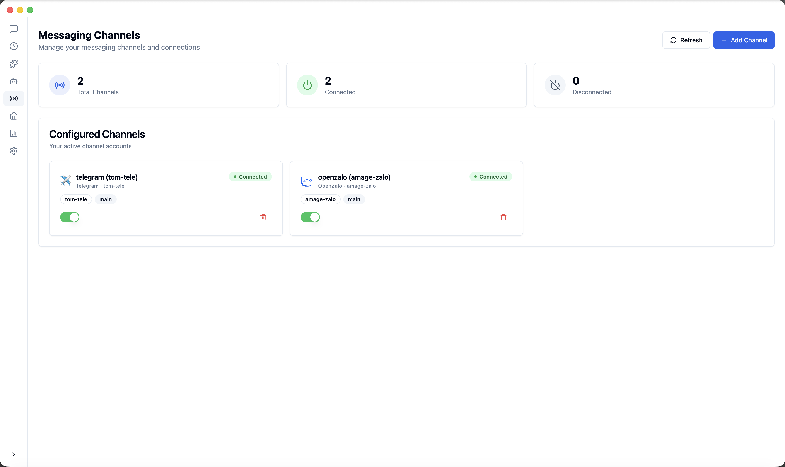
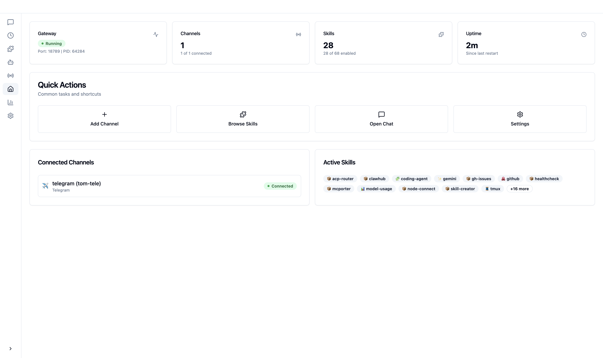
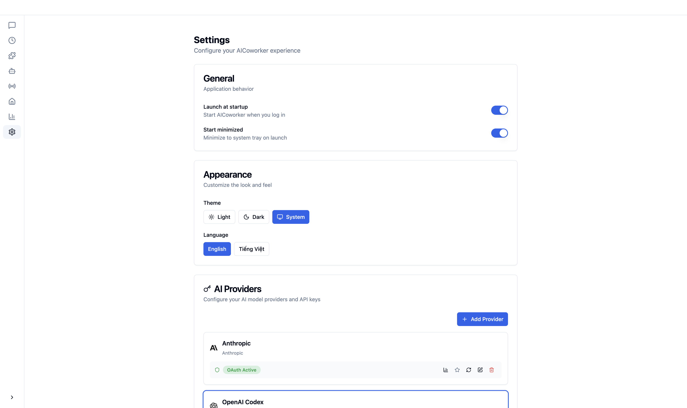

<p align="center">
  
</p>

<h1 align="center">CrawBot</h1>

<p align="center">
  <strong>Personal Agentic AI Assistant for non-tech users powered by OpenClaw</strong>
</p>

<p align="center">
  <a href="#features">Features</a> •
  <a href="#why-crawbot">Why CrawBot</a> •
  <a href="#getting-started">Getting Started</a> •
  <a href="#architecture">Architecture</a> •
  <a href="#community">Community</a>
</p>

<p align="center">
  
  
  
  <a href="https://www.facebook.com/groups/crawbot" target="_blank">
  
  </a>
  
  
</p>

<p align="center">
  English
</p>

---

## Overview

**CrawBot** bridges the gap between powerful AI agents and everyday users. Built on top of [OpenClaw](https://github.com/OpenClaw), it transforms command-line AI orchestration into an accessible, beautiful desktop experience—no terminal required.

Whether you're automating workflows, managing AI-powered channels, or scheduling intelligent tasks, CrawBot provides the interface you need to harness AI agents effectively.

CrawBot comes pre-configured with best-practice model providers and natively supports Windows as well as multi-language settings. Of course, you can also fine-tune advanced configurations via **Settings → Advanced → Developer Mode**.

---

## Screenshots

<p align="center">
  
</p>

<p align="center">
  
</p>

<p align="center">
  
</p>

<p align="center">
  
</p>

<p align="center">
  
</p>

<p align="center">
  
</p>

---

## Why CrawBot

Building AI agents shouldn't require mastering the command line. CrawBot was designed with a simple philosophy: **powerful technology deserves an interface that respects your time.**

| Challenge | CrawBot Solution |
|-----------|----------------|
| Complex CLI setup | One-click installation with guided setup wizard |
| Configuration files | Visual settings with real-time validation |
| Process management | Automatic gateway lifecycle management |
| Multiple AI providers | Unified provider configuration panel |
| Skill/plugin installation | Built-in skill marketplace and management |

### OpenClaw Inside

CrawBot is built directly upon the official **OpenClaw** core. Instead of requiring a separate installation, we embed the runtime within the application to provide a seamless "battery-included" experience.

We are committed to maintaining strict alignment with the upstream OpenClaw project, ensuring that you always have access to the latest capabilities, stability improvements, and ecosystem compatibility provided by the official releases.

---

## Features

### 🎯 Zero Configuration Barrier
Complete the entire setup—from installation to your first AI interaction—through an intuitive graphical interface. No terminal commands, no YAML files, no environment variable hunting.

### 💬 Intelligent Chat Interface
Communicate with AI agents through a modern chat experience. Support for multiple conversation contexts, message history, and rich content rendering with Markdown.

### 📡 Multi-Channel Management
Configure and monitor multiple AI channels simultaneously. Each channel operates independently, allowing you to run specialized agents for different tasks.

### ⏰ Cron-Based Automation
Schedule AI tasks to run automatically. Define triggers, set intervals, and let your AI agents work around the clock without manual intervention.

### 🧩 Extensible Skill System
Extend your AI agents with pre-built skills. Browse, install, and manage skills through the integrated skill panel—no package managers required.

### 🔐 Secure Provider Integration
Connect to multiple AI providers (OpenAI, Anthropic, and more) with credentials stored securely in your system's native keychain.

### 🌙 Adaptive Theming
Light mode, dark mode, or system-synchronized themes. CrawBot adapts to your preferences automatically.

---

## Getting Started

### System Requirements

- **Operating System**: macOS 11+, Windows 10+, or Linux (Ubuntu 20.04+)
- **Memory**: 4GB RAM minimum (8GB recommended)
- **Storage**: 1GB available disk space

### Installation

Download the latest installer for your platform from the [Releases](https://github.com/Neurons-AI/crawbot/releases/latest) page.

#### macOS
- **Apple Silicon (M1/M2/M3/M4)**: `CrawBot-*-mac-arm64.dmg`
- **Intel (x64)**: `CrawBot-*-mac-x64.dmg`

#### Windows
- **Installer (x64)**: `CrawBot-*-win-x64.exe`
- **Installer (ARM64)**: `CrawBot-*-win-arm64.exe`

#### Linux
- **AppImage (x64)**: `CrawBot-*-linux-x86_64.AppImage` (recommended)
- **AppImage (ARM64)**: `CrawBot-*-linux-arm64.AppImage`
- **Debian/Ubuntu (x64)**: `CrawBot-*-linux-amd64.deb`
- **Debian/Ubuntu (ARM64)**: `CrawBot-*-linux-arm64.deb`
- **RPM (x64)**: `CrawBot-*-linux-x86_64.rpm`

### Installation Notes

- **macOS**: On first launch, you may see "cannot verify developer". Go to **System Preferences → Security & Privacy** to allow the app to run.
- **Windows**: SmartScreen may block the app on first launch. Click **More info → Run anyway** to proceed.
- **Linux**: AppImage requires executable permission: `chmod +x CrawBot-*.AppImage`

### Automatic Updates

CrawBot ships with a built-in updater. Once installed, the app checks this repository for new releases and prompts you to download and restart when an update is available—no manual reinstall needed.

### First Launch

When you launch CrawBot for the first time, the **Setup Wizard** will guide you through:

1. **Language & Region** – Configure your preferred locale
2. **AI Provider** – Enter your API keys for supported providers
3. **Skill Bundles** – Select pre-configured skills for common use cases
4. **Verification** – Test your configuration before entering the main interface

---

## Architecture

CrawBot employs a **dual-process architecture** that separates UI concerns from AI runtime operations:

```
┌─────────────────────────────────────────────────────────────────┐
│                        CrawBot Desktop App                       │
│                                                                  │
│  ┌────────────────────────────────────────────────────────────┐  │
│  │              Electron Main Process                          │  │
│  │  • Window & application lifecycle management                │  │
│  │  • Gateway process supervision                              │  │
│  │  • System integration (tray, notifications, keychain)       │  │
│  │  • Auto-update orchestration                                │  │
│  └────────────────────────────────────────────────────────────┘  │
│                              │                                   │
│                              │ IPC                               │
│                              ▼                                   │
│  ┌────────────────────────────────────────────────────────────┐  │
│  │              React Renderer Process                         │  │
│  │  • Modern component-based UI (React 19)                     │  │
│  │  • State management with Zustand                            │  │
│  │  • Real-time WebSocket communication                        │  │
│  │  • Rich Markdown rendering                                  │  │
│  └────────────────────────────────────────────────────────────┘  │
└──────────────────────────────┬───────────────────────────────────┘
                               │
                               │ WebSocket (JSON-RPC)
                               ▼
┌─────────────────────────────────────────────────────────────────┐
│                     OpenClaw Gateway                            │
│                                                                 │
│  • AI agent runtime and orchestration                           │
│  • Message channel management                                   │
│  • Skill/plugin execution environment                           │
│  • Provider abstraction layer                                   │
└─────────────────────────────────────────────────────────────────┘
```

### Design Principles

- **Process Isolation**: The AI runtime operates in a separate process, ensuring UI responsiveness even during heavy computation
- **Graceful Recovery**: Built-in reconnection logic with exponential backoff handles transient failures automatically
- **Secure Storage**: API keys and sensitive data leverage the operating system's native secure storage mechanisms
- **Seamless Updates**: The integrated auto-updater keeps your installation current with the latest improvements

---

## Use Cases

### 🤖 Personal AI Assistant
Configure a general-purpose AI agent that can answer questions, draft emails, summarize documents, and help with everyday tasks—all from a clean desktop interface.

### 📊 Automated Monitoring
Set up scheduled agents to monitor news feeds, track prices, or watch for specific events. Results are delivered to your preferred notification channel.

### 💻 Developer Productivity
Integrate AI into your development workflow. Use agents to review code, generate documentation, or automate repetitive coding tasks.

### 🔄 Workflow Automation
Chain multiple skills together to create sophisticated automation pipelines. Process data, transform content, and trigger actions—all orchestrated visually.

---

## Powered By

CrawBot is built with industry-leading technologies:

- [OpenClaw](https://github.com/OpenClaw) – The AI agent runtime
- [Electron](https://www.electronjs.org/) – Cross-platform desktop framework
- [React](https://react.dev/) – UI component library

---

## Support & Feedback

- 🐛 **Report a bug or request a feature**: [Open an issue](https://github.com/Neurons-AI/crawbot/issues)
- 💬 **Thảo luận về CrawBot**: [Tham gia Facebook Group](https://www.facebook.com/groups/crawbot)

[](https://www.facebook.com/groups/crawbot)

---

## License

CrawBot is **source-available** software released under the [PolyForm Perimeter License 1.0.0](LICENSE).
Copyright © 2026 Neurons AI. All rights reserved.

**You're free to:**
- Use CrawBot for free — personally or commercially within any company
- Read, audit, and modify the [source code](https://github.com/Neurons-AI/crawbot-source) for your own or your company's internal use
- Fork and share modifications

**You're not allowed to:**
- Resell, host, or distribute CrawBot as a competing product (e.g., SaaS hosting, white-label rebrand, hosted-API extraction of internal modules)
- Remove copyright or license notices

For a friendly, side-by-side English / Tiếng Việt summary, see [LICENSE_PLAIN_ENGLISH.md](LICENSE_PLAIN_ENGLISH.md).

For commercial licensing (SaaS hosting, OEM bundle, white-label), contact **[contact@neurons.ai]**.

---

<p align="center">
  <sub>Built with ❤️ by the Neurons AI Team</sub>
</p>
