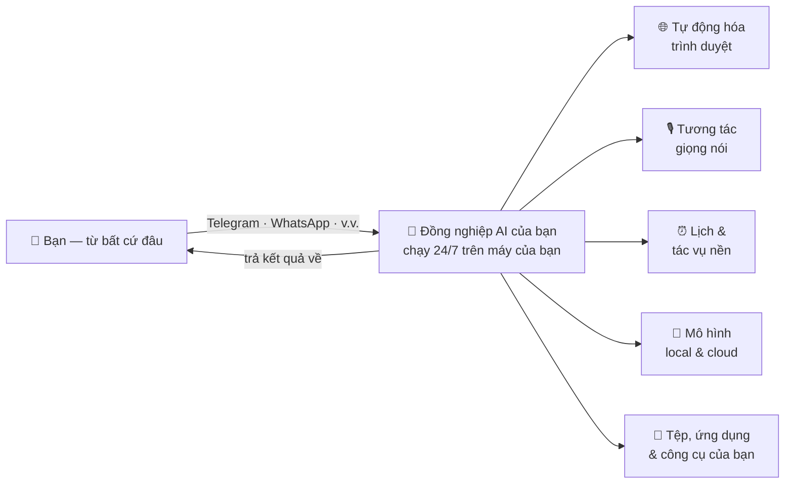
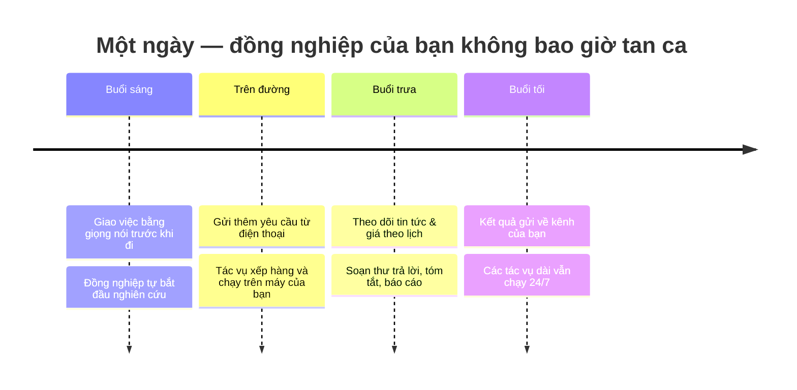
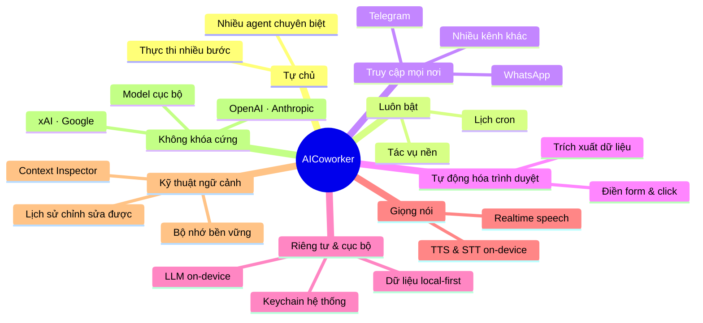

  

<h1 align="center">AICoworker</h1>

  <strong>Trợ lý AI Agentic cho công việc tri thức</strong>

  Một Đồng nghiệp AI thật sự, chạy 24/7 trên máy tính cá nhân của bạn, truy cập an toàn từ bất cứ đâu, 
  và có khả năng hoàn thành công việc một cách hoàn toàn tự chủ.

  <a href="#aicoworker-là-gì">AICoworker là gì</a> •
  <a href="#điểm-khác-biệt">Điểm khác biệt</a> •
  <a href="#năng-lực">Năng lực</a> •
  <a href="#tải-về">Tải về</a> •
  <a href="#giấy-phép">Giấy phép</a>

  
  
  
  

  <a href="README.md">English</a> | Tiếng Việt

---

## AICoworker là gì

**AICoworker là một đồng nghiệp AI thật sự, không chỉ là một chatbot.** Nó sống ngay trên máy tính của bạn, làm việc suốt ngày đêm, và có thể truy cập từ bất cứ đâu — để bạn giao những công việc tri thức thật sự và nhận kết quả ngay cả khi đang rời khỏi bàn làm việc.

Hầu hết các công cụ AI đều chờ bạn gõ một câu lệnh rồi ngồi xem kết quả. AICoworker được sinh ra để **giao việc**: hãy đưa cho nó một mục tiêu, và nó sẽ tự lên kế hoạch, sử dụng công cụ, chạy các quy trình nhiều bước, rồi báo cáo lại — tất cả một cách tự chủ. Vì chạy trên *chính máy của bạn*, nó có ngữ cảnh, tệp tin, tài khoản và công cụ giống như một đồng nghiệp thật, trong khi dữ liệu của bạn vẫn nằm trong tầm kiểm soát của bạn.

- **Chạy 24/7 trên máy tính cá nhân** — một agent luôn bật, tiếp tục làm việc ở chế độ nền, theo lịch, hoặc phản hồi theo sự kiện, ngay cả khi bạn không ngồi trước máy.
- **Truy cập an toàn từ bất cứ đâu** — kết nối với đồng nghiệp AI qua các ứng dụng nhắn tin hằng ngày. Giao việc từ điện thoại trên đường đi làm; nó thực thi ngay tại bàn làm việc của bạn.
- **Hoàn thành công việc hoàn toàn tự chủ** — kế hoạch nhiều bước, sử dụng công cụ, thao tác tệp tin, tự động hóa trình duyệt, và các tác vụ theo lịch chạy đến khi hoàn tất mà không cần cầm tay chỉ việc.

---

## Ảnh chụp màn hình

  

  

  

  

  

  

  

  

---

## Điểm khác biệt

Các trợ lý chat trên cloud là "bộ não đi thuê" đặt trong trung tâm dữ liệu của người khác. AICoworker là một đồng nghiệp **sống trên máy của bạn và làm việc cho bạn** — điều đó thay đổi hoàn toàn những gì nó có thể làm.

| Chatbot AI thông thường | AICoworker |
|-------------------------|------------|
| Chờ từng câu lệnh, bạn ngồi xem nó làm | Giao một mục tiêu — nó tự lên kế hoạch và thực thi trọn vẹn |
| Chỉ online, mỗi lần một tab | Chạy 24/7 ở chế độ nền, theo lịch, qua nhiều kênh |
| Dữ liệu của bạn nằm trên cloud | Ưu tiên cục bộ — chạy trên máy bạn, dữ liệu ở lại với bạn |
| Khóa cứng vào model của một nhà cung cấp | Trộn model cloud + on-device tự do; đổi theo từng việc |
| Chỉ text vào, text ra | Tự động hóa trình duyệt, thao tác tệp, giọng nói, hình ảnh, công cụ |
| Chỉ truy cập được từ website của nó | Truy cập từ Telegram, WhatsApp, v.v. — từ bất cứ đâu |
| Quên sạch giữa các phiên | Bộ nhớ bền vững và ngữ cảnh minh bạch, chỉnh sửa được |

### Một ngày cùng đồng nghiệp AI

---

## Năng lực

### 🤖 Hoàn thành công việc hoàn toàn tự chủ
Hãy giao một mục tiêu, không chỉ một câu lệnh. AICoworker chia công việc thành các bước, gọi công cụ, tự động hóa trình duyệt, đọc và ghi tệp tin, chạy lệnh, rồi đưa toàn bộ tác vụ đến khi hoàn tất — sau đó báo cáo lại. Bạn có thể tạo **nhiều agent chuyên biệt** (ví dụ một trợ lý nghiên cứu, một trợ lý bán hàng, một trợ lý pháp lý), mỗi agent có workspace, model và tính cách riêng.

### 🌐 Tự động hóa trình duyệt (Agentic Browser)
Một trình duyệt tích hợp mà agent thật sự *sử dụng được* — điều hướng website, điền form, click qua các luồng, trích xuất dữ liệu, và hoàn thành các tác vụ web như một con người, với khả năng chống phát hiện (anti-detection) nâng cao để các trang thật hoạt động trơn tru. Nó cũng mở khóa đăng nhập web cho các dịch vụ AI, để agent hành động thay bạn — an toàn, ngay trên máy của bạn.

### 🧠 Local LLM — AI riêng tư, chạy ngay trên thiết bị
Chạy các model đủ mạnh **hoàn toàn trên phần cứng của bạn** — không API key, không cloud, không dữ liệu nào rời khỏi máy. Model on-device hỗ trợ **đa phương thức gốc** (ảnh *và* âm thanh), tăng tốc bằng GPU, cho bạn một trợ lý hoàn toàn riêng tư kể cả khi offline. Kết hợp linh hoạt: dùng model cloud hàng đầu cho suy luận khó, dùng model cục bộ cho việc riêng tư hoặc khối lượng lớn.

### 🎙️ Tương tác giọng nói thời gian thực
Nói chuyện với đồng nghiệp và nghe nó trả lời. Push-to-talk và speech-to-speech độ trễ thấp giúp bạn giao việc rảnh tay, với cả giọng nói realtime trên cloud lẫn **giọng nói on-device (TTS + STT)** cho hội thoại riêng tư, offline.

### ⏰ Lịch & tự động hóa luôn bật
Đồng nghiệp của bạn không tan ca. Lên lịch các tác vụ định kỳ kiểu cron, khởi chạy các tác vụ nền chạy lâu, và để agent làm việc suốt ngày đêm — giám sát, tóm tắt, hành động trong khi bạn ngủ. Kết quả gửi về kênh bạn chọn.

### 📡 Đa kênh — truy cập từ bất cứ đâu
Kết nối các kênh nhắn tin hằng ngày (Telegram, WhatsApp, v.v.) để giao việc và nhận kết quả dù bạn đang ở đâu. Gửi yêu cầu từ điện thoại trên đường; nó chạy trên máy của bạn và trả lời qua chính kênh đó.

### 🔐 Bảo mật & riêng tư cấp doanh nghiệp
**Ưu tiên cục bộ theo thiết kế.** Công việc chạy trên máy của bạn và dữ liệu ở lại với bạn — không nằm trên server của nhà cung cấp. Thông tin xác thực và API key được lưu trong **keychain an toàn gốc** của hệ điều hành, không bao giờ ở dạng plaintext. Kết hợp với model on-device, AICoworker phù hợp cho công việc tri thức nhạy cảm và bị quản lý chặt, nơi việc lưu trữ dữ liệu trong tầm kiểm soát là yêu cầu bắt buộc.

### 🧩 Kỹ thuật ngữ cảnh nâng cao (Context Engineering)
Nhìn thấy và kiểm soát chính xác những gì AI đang "nghĩ" tới. **Context Inspector** tích hợp phân rã từng request gửi đi để bạn kiểm tra, đưa vào hoặc loại bỏ nội dung đến từng token. **Bộ nhớ phiên bền vững** giúp đồng nghiệp của bạn liền mạch qua nhiều ngày, và bạn có thể **thêm, sửa, xóa** bất kỳ phần nào trong lịch sử hội thoại — kiểm soát chính xác chi phí, sự tập trung và độ chính xác.

### 🔌 Mang model của riêng bạn — không khóa cứng
Kết nối nhiều nhà cung cấp AI (OpenAI, Anthropic, xAI/Grok, Google, model on-device, và nhiều hơn) và chọn đúng model cho từng việc. Đổi nhà cung cấp tự do; bạn không bao giờ bị khóa vào một nhà cung cấp duy nhất.

### 🛠️ Kỹ năng mở rộng
Mở rộng đồng nghiệp với các kỹ năng cài thêm cho khả năng và tích hợp mới. Duyệt, cài đặt và quản lý từ một bảng trực quan — không cần trình quản lý gói, không terminal.

### 📊 Thống kê sử dụng & chi phí
Bảng thống kê tích hợp cho thấy token đi đâu, model và công cụ nào tốn chi phí, và xu hướng sử dụng theo thời gian — để một đồng nghiệp AI luôn-bật không bao giờ trở thành "hộp đen".

### 🎯 Ứng dụng desktop không cần cấu hình, đa ngôn ngữ
Cài là chạy. Trình hướng dẫn thiết lập đưa bạn từ lúc cài đến tác vụ tự chủ đầu tiên mà không cần terminal, không file cấu hình, không rào cản — với chế độ sáng/tối và giao diện đa ngôn ngữ (English, Tiếng Việt, 中文, 日本語).

---

## Tải về

Tải bản phát hành mới nhất cho nền tảng của bạn — không cài đặt phức tạp, không dòng lệnh:

### 👉 [Tải AICoworker (bản mới nhất)](https://github.com/Neurons-ai/AICoworker/releases/latest)

Hỗ trợ **macOS**, **Windows**, và **Linux**.

### Yêu cầu hệ thống

- **Hệ điều hành**: macOS 11+, Windows 10+, hoặc Linux (Ubuntu 20.04+)
- **Bộ nhớ**: Tối thiểu 4GB RAM (khuyến nghị 8GB; nhiều hơn nếu chạy model on-device)
- **Dung lượng**: 1GB trống (cộng thêm dung lượng cho các model cục bộ bạn tải về)

### Lần khởi động đầu tiên

Khi bạn mở AICoworker lần đầu, **Trình hướng dẫn thiết lập** sẽ dẫn bạn qua:

1. **Ngôn ngữ & Khu vực** – Chọn ngôn ngữ ưa thích
2. **Nhà cung cấp AI** – Kết nối tài khoản hoặc nhập API key (hoặc chọn một model on-device)
3. **Gói kỹ năng** – Chọn kỹ năng cấu hình sẵn cho các trường hợp phổ biến
4. **Xác minh** – Kiểm tra mọi thứ hoạt động trước khi bắt đầu giao việc

---

## Cộng đồng

Tham gia cộng đồng để kết nối với người dùng khác, nhận hỗ trợ và chia sẻ những gì đồng nghiệp AI của bạn đang hoàn thành.

---

## Giấy phép

AICoworker là phần mềm **source-available** — mã nguồn được công khai để bạn đọc và kiểm tra (audit), nhưng **không phải mã nguồn mở (open-source)**. Phần mềm phát hành theo [PolyForm Perimeter License 1.0.0](LICENSE).
Bản quyền © 2026 Neurons AI. Bảo lưu mọi quyền.

**Bạn được phép:**
- Sử dụng AICoworker miễn phí — cá nhân hoặc cho mục đích thương mại trong bất kỳ doanh nghiệp nào
- Đọc và kiểm tra (audit) mã nguồn cho mục đích cá nhân / nội bộ doanh nghiệp

**Bạn không được phép:**
- Bán lại, host, hoặc phân phối AICoworker như một sản phẩm cạnh tranh (vd: host SaaS, đổi tên thương hiệu, trích xuất các module nội bộ thành API có host)
- Xóa thông báo bản quyền hoặc giấy phép

Bản tóm tắt thân thiện song ngữ Anh / Việt: xem [LICENSE_PLAIN_ENGLISH.md](LICENSE_PLAIN_ENGLISH.md).

Để xin **giấy phép thương mại** (host SaaS, OEM bundle, white-label), vui lòng liên hệ **contact@neuronsai.net**.

---

  Được xây dựng với ❤️ bởi đội ngũ Neurons AI

